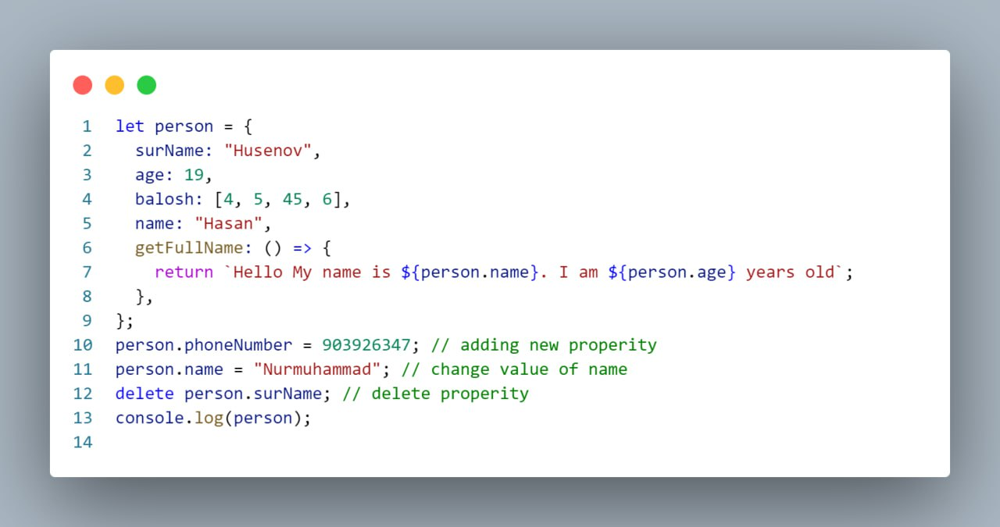
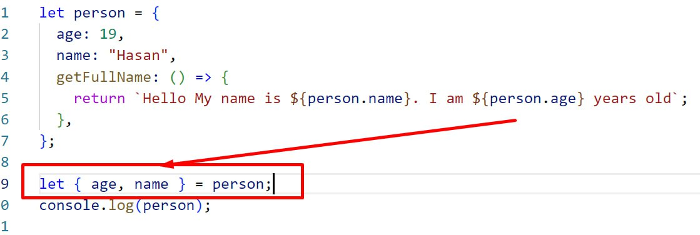

# What is Object in JavaScript?
## In JavaScript, an object is a data structure that stores key-value pairs. It's a way to group related data and functionality together. Objects are versatile and can represent real-world entities, such as a person, a car, or a book. 

#### ***(В JavaScript объект - это структура данных, которая хранит пары ключ-значение. Это способ группировать связанные данные и функциональность вместе. Объекты универсальны и могут представлять сущности реального мира, такие как человек, машина или книга.)***

```
// Creating an object representing a person
let person = {
    firstName: "Parviz",
    lastName: "Yuldoshev",
    age: 18
  };
  
  // Accessing properties of the object
  console.log(person.firstName); // Output: John
  console.log(person.age); // Output: 30
  console.log(person.lastName); // Output: Yuldoshev
```

___



___

# `Object.entries()`
## The `Object.entries()` method in JavaScript returns an array of a given object's own enumerable string-keyed property [key, value] pairs, in the same order as that provided by a for...in loop (the difference being that a for-in loop enumerates properties in the prototype chain as well). The order of the array returned by Object.entries() is consistent with the order in which properties are exposed by a for...in loop (or by Object.keys()).

#### ***(Метод `Object.entries()` в JavaScript возвращает массив пар [ключ, значение] собственных перечислимых свойств указанного объекта, в том же порядке, что и указано циклом for...in (отличие заключается в том, что цикл for-in перечисляет свойства также и в цепочке прототипов). Порядок массива, возвращаемого Object.entries(), согласуется с порядком, в котором свойства отображаются циклом for...in (или методом Object.keys()).)***

```
const person = {
  firstName: 'John',
  lastName: 'Doe',
  age: 30
};

const entries = Object.entries(person);
console.log(entries);

```
```
[ [ 'firstName', 'John' ], [ 'lastName', 'Doe' ], [ 'age', 30 ] ]

```
### ***В этом примере у нас есть объект `person` с свойствами `firstName`, `lastName` и `age`.Мы используем `Object.entries(person)`, чтобы преобразовать свойства объекта в массив пар ключ-значение.Результирующий массив содержит массивы, в которых каждый внутренний массив содержит два элемента: ключ (имя свойства) и соответствующее значение из объекта***
___

# `Object.keys()`

## The `Object.keys()` method in JavaScript is used to extract all the keys (property names) of a given object and returns them as an array.

#### ***(Метод `Object.keys()` в JavaScript используется для извлечения всех ключей (имен свойств) указанного объекта и возвращает их в виде массива.)***

```
const person = {
  firstName: 'John',
  lastName: 'Doe',
  age: 30
};

const keys = Object.keys(person);
console.log(keys);

```
```
Output:
["firstName", "lastName", "age"]

```
### ***В этом примере у нас есть объект `person` с свойствами `firstName`, `lastName` и `age`. Мы используем `Object.keys(person)` для извлечения всех ключей объекта `person`. Метод возвращает массив, содержащий все ключи объекта.***
___

# Difference between `Object.keys()` and `Object.entries()`

## `Object.keys()`:

* Этот метод возвращает массив, содержащий все ключи (имена свойств)  указанного объекта.
*    Он извлекает только ключи из объекта.
*   Каждый элемент возвращаемого массива представляет собой ключ объекта.
*  Порядок ключей в массиве соответствует порядку, в котором они определены в объекте.

```
const person = {
  firstName: 'John',
  lastName: 'Doe',
  age: 30
};

const keys = Object.keys(person);
console.log(keys); // Вывод: ["firstName", "lastName", "age"]

```

## `Object.entries()`:

 *  Этот метод возвращает массив массивов, где каждый внутренний массив    содержит пару ключ-значение указанного объекта.
 *  Он извлекает как ключи, так и их соответствующие значения из объекта.
 * Каждый внутренний массив представляет собой пару ключ-значение, где  первый элемент - это ключ, а второй элемент - соответствующее значение.
 *   Порядок массива соответствует порядку, в котором пары ключ-значение определены в объекте.

```
const person = {
  firstName: 'John',
  lastName: 'Doe',
  age: 30
};

const entries = Object.entries(person);
console.log(entries); // Вывод: [["firstName", "John"], ["lastName", "Doe"], ["age", 30]]

```

___

# `Object.values()`

## Метод `Object.values()` в JavaScript используется для извлечения всех значений свойств указанного объекта и возвращает их в виде массива.

```
const person = {
  firstName: 'John',
  lastName: 'Doe',
  age: 30
};

const values = Object.values(person);
console.log(values);

```
```
Output:
["John", "Doe", 30]

```

___

###     В этом примере у нас есть объект `person` с свойствами `firstName`, `lastName` и `age`.
 ###    Мы используем `Object.values(person)` для извлечения всех значений свойств объекта person.
 ###    Метод возвращает массив, содержащий все значения свойств объекта.

 ### Таким образом, в отличие от `Object.keys()`, который возвращает массив ключей, и `Object.entries()`, который возвращает массив массивов ключей и их значений, `Object.values()` возвращает только значения свойств объекта в виде массива.

 ___

 # Distructuring and Spread() 
## Destructuring assignment is a special syntax in JavaScript that allows you to extract values from arrays or properties from objects and store them in variables in a concise and easy-to-read way.

#### ***(Деструктуризация в JavaScript - это способ извлечения данных из массивов и объектов, помещая их в переменные.)***

### Деструктуризация массивов:
```
const numbers = [1, 2, 3, 4, 5];
const [first, second, ...rest] = numbers;

console.log(first);  // Вывод: 1
console.log(second); // Вывод: 2
console.log(rest);   // Вывод: [3, 4, 5]

```
___

### Деструктуризация объектов:
```
const person = { firstName: 'John', lastName: 'Doe', age: 30 };
const { firstName, lastName, age } = person;

console.log(firstName); // Вывод: John
console.log(lastName);  // Вывод: Doe
console.log(age);       // Вывод: 30

```


___

# Оператор расширения `(Spread Operator)`:

## The spread syntax allows an iterable (like an array or a string) to be expanded into individual elements. It can be used in function calls, array literals, and object literals.

#### ***(Оператор расширения (spread operator) позволяет распространять элементы массива или свойства объекта для использования их в другом массиве или объекте.)***

### Распространение массивов:

```
const arr1 = [1, 2, 3];
const arr2 = [...arr1, 4, 5];

console.log(arr2); // Вывод: [1, 2, 3, 4, 5]

```

### Распространение объектов:

```
const obj1 = { firstName: 'John', lastName: 'Doe' };
const obj2 = { age: 30, ...obj1 };

console.log(obj2); // Вывод: { age: 30, firstName: 'John', lastName: 'Doe' }

```

### В обоих случаях оператор расширения (spread operator) используется для копирования элементов или свойств из одного массива или объекта в другой, что делает код более читаемым и компактным.